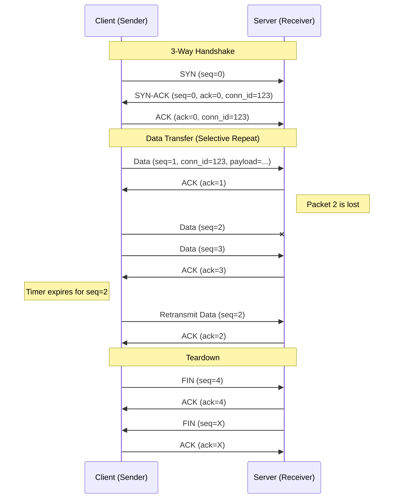
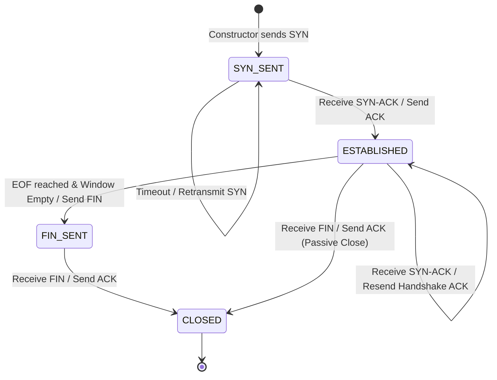
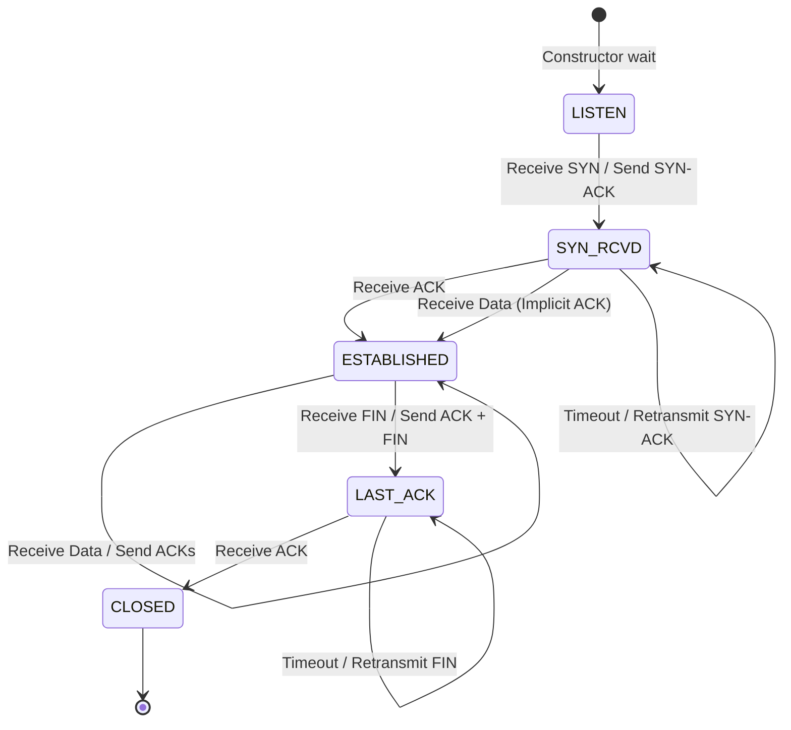

# ipk-rdt: Reliable Data Transfer over UDP

## Project Overview
`ipk-rdt` is a user-space transport protocol implementation that provides reliable, ordered, and integrity-protected delivery of arbitrary byte streams over the unreliable UDP protocol. It is designed to emulate the core reliability features of TCP while adhering to specific project constraints, such as a 1200-byte maximum segment size.

## Build and Run

### Prerequisites
  * **Environment**: Linux (x86_64) with `g++` supporting `C++20`.
  * **Tools**: `make`, `g++`, `awk`, `dd`.
  * **Testing Dependencies**: `Python 3.10+`, `valgrind`, `iproute2` (for tc netem).

### Compilation
To build the primary executable, run the following command in the project root:

```bash
make
```

This produces the standalone binary `ipk-rdt`.

### Basic Usage
The application operates in either *server* (-s) or *client* (-c) mode.

**Start the Server**:

``` bash
./ipk-rdt -s -p 9000 -o received_data.bin
-p: UDP port to listen on.
-o: Destination file (omitting this or using - defaults to stdout).
```

**Start the Client**:

``` bash
./ipk-rdt -c -a 127.0.0.1 -p 9000 -i source_data.bin
-a: Destination IPv4/IPv6 address or hostname.
-i: Source file (omitting this or using - defaults to stdin).
```

**Cleanup**
To remove compiled object files, binaries, and temporary test artifacts:

``` bash
make clean
```

**Execution Examples**
Stdin to Stdout Transfer:

``` bash
# Terminal 1 (Server)
./ipk-rdt -s -p 9000

# Terminal 2 (Client)
echo "Hello IPK" | ./ipk-rdt -c -a 127.0.0.1 -p 9000
```

IPv6 Transfer with Timeout:

``` bash
./ipk-rdt -s -p 9000 -a ::1 -w 5
./ipk-rdt -c -a ::1 -p 9000 -i large_file.zip -w 5
```

## Protocol Specification

### Packet header format
The protocol uses a fixed size 20 byte header that provides all the necessary control information with minimal overhead. All multi byte fields are transmitted in Network Byte Order.

| Byte Offset | Field Name            | Size (Bytes) | Description                                           |
|:------------|:----------------------|:-------------|:------------------------------------------------------|
| 0           | Connection ID         | 4            | Unique 32-bit identifier for the session.             |
| 4           | Sequence Number       | 4            | Increasing ID for data segments.                      |
| 8           | Acknowledgment Number | 4            | The sequence number being confirmed by the peer.      |
| 12          | Flags                 | 2            | Control bits: SYN(0x1), ACK(0x2), FIN(0x4), RST(0x8). |
| 14          | Payload Length        | 2            | Size of the data following the header (0 to 1180).    |
| 16          | Checksum              | 4            | IEEE 802.3 CRC32 over the header and payload.         |

### Connection Identification
To prevent accidental confusion between packets from different transfers or late-arriving segments from a previous session, a 32-bit Connection ID is used. During the Handshake, the Receiver generates a cryptographically secure random 32-bit integer upon receiving a SYN packet. This ID is sent back in the SYN-ACK. From that point forward, both the Sender and Receiver discard any packets that do not contain the matching Connection ID.

### Session Management
**Handshake**
  1. `SYN`: Sender sends a `SYN` (seq=0) and enters SYN_SENT state.
  2. `SYN-ACK`: Receiver responds with `SYN-ACK` (seq=0, ack=0, ConnID) and enters SYN_RCVD.
  3. `ACK`: Sender receives the ID, sends a final `ACK`, and enters ESTABLISHED. The Receiver enters ESTABLISHED upon arrival of the first `ACK` or data packet.

**Teardown**
  1. `FIN`: Once the Sender reaches EOF and all data is `ACK`ed, it sends a `FIN` packet.
  2. `ACK`: Receiver acknowledges the `FIN`.
  3. `FIN`: Receiver sends its own `FIN` to signal it is ready to close.
  4. `ACK`: Sender sends the final `ACK` and enters CLOSED. Receiver enters CLOSED upon receipt.




### Reliability and Window Management
**Sequencing**
The protocol uses segment-based sequencing rather than byte-offsets. Each data segment (up to 1180 bytes) is assigned a single 32-bit sequence number. This simplifies the management of the sliding window and out-of-order buffers.

**Selective Repeat**
* Sender: Maintains a `std::deque` of unacknowledged packets. When an ACK arrives, the specific packet is marked as is_acked. The window only "slides" (removes packets) when the packet at the front of the deque is marked as ACKed.
* Receiver: Uses a `std::map<uint32_t, vector<uint8_t>>` to buffer packets that arrive out-of-order. When the hole is filled (i.e., pkt.seq_num == rcv_base), the Receiver flushes all contiguous packets from the buffer to the output stream.

**Retransmission Strategy (RFC 6298)**
The protocol uses a dynamic Retransmission TimeOut (RTO) to adapt to network conditions:
* Initial RTO: 500ms.
* Calculations:
    * $RTTVAR = (0.75 \times RTTVAR) + (0.25 \times |SRTT - R|)$
    * $SRTT = (0.875 \times SRTT) + (0.125 \times R)$
    * $RTO = SRTT + \max(10ms, 4 \times RTTVAR)$
* Exponential Backoff: If a timeout occurs, the RTO is doubled ($RTO = RTO \times 2$) up to a maximum of 5 seconds to ensure it stays within the typical -w global timeout limits.

**Window Behavior**
* Fixed Window Size: 64 segments.
* Segment Limit: 1180 bytes of payload per UDP datagram.
* Backpressure: The Sender uses the get_io_fd() mechanism to stop reading from the input file when the window is full (64 segments), resuming only when an ACK slides the window forward.

## Implementation Design
The application is built using an Event Driven, Object Oriented architecture. Instead of using multiple threads and managing complex locking mechanism, the system relies on a single threaded execution loop managed by the **Application** class.
The core of the system is the `poll()` system call. In every iteration of the main program loop (`Application::run()`), the program monitors two potential events:
  1. network event - incoming data from the UDP socket, or
  2. I/O event - availability of data in the input file, this event is specific for Sender.
When `poll()` returns, the `Application` hands the event over to the appropriate handler in the `RdtEndpoint`, either `handle_network_event`, or `handle_io_event`.

**State machine**
`RdtSender` and `RdtReceiver` are implemented as finite state machines. Both of these classes inherit from a common `RdtEndpoint` interface, providing a polymorphic way of handling the network logic regardless of the application mode.

**Sender state machine**


**Receiver state machine**


**Timer Management**
To avoid busy waiting, the `TimerManager` class handles the *retransmission timeout* (RTO) as well as the global progress timeout. The `get_next_timeout_ms()` method calculates the exact number of milliseconds remaining until the soonest of those two deadlines and passes it to the `poll()`. This allows the CPU to sleep when no action is required.


## Testing and Performance
**Testing Environment**
* **OS:** Linux 6.19.13-arch1-1
* **Hardware:** Intel Core i5-6300U, 4 GiB of RAM :(
* **Tools:** `tc netem`, `valgrind`, `sha256sum`

*Verified within the official Nix devShell*

**Performance Measurements**

These commands were used for the performance testing:
```bash
make clean && make
export PYTHONPATH=$PYTHONPATH:$(pwd)/tests

# Baseline
python3 -m unittest tests/test_io_modes.py -k test_baseline_file_transfer

# Big File
python3 -m unittest tests/test_io_modes.py -k test_larger_file_transfer

# High loss
python3 -m unittest tests/test_resilience.py -k test_packet_loss

# Congested
python3 -m unittest tests/test_resilience.py -k test_jitter_and_delay

# Adverse
python3 -m unittest tests/test_resilience.py -k test_combined_impairments

# Empty file
python3 -m unittest tests/test_basic_transfer.py -k test_empty_file_transfer

# netem
bash tests/test_netem.sh


```

| Scenario   | Data Size | Network Conditions           | Time (s)  | Integrity (SHA-256) |
|------------|-----------|------------------------------|-----------|---------------------|
| Baseline   | 50 KB     | Ideal (No loss/delay)        | ~0.211s   | Match               |
| Big File   | 50 MB     | Larger file (No loss/delay)  | ~2.285s   | Match               |
| High Loss  | 50 KB     | 15% Packet Loss              | ~1.077s   | Match               |
| Congested  | 50 KB     | 20ms Delay, 10ms Jitter      | ~0.852s   | Match               |
| Adverse    | 50 KB     | 5% Loss, 5% Dup, 10% Reorder | ~0.738s   | Match               |
| Empty File | 0 B       | Ideal                        | ~0.209s   | Match               |
| netem      | 5 MB      | 10% Loss, 5% Dup, 20ms Jitter| ~12.494s  | Match               |

**Automated Test Suites**
1. **Unit Tests (doctest):** Verifies CRC32 calculation, packet (de)serialization, and RFC 6298 mathematical correctness.
2. **Integration Tests** (unittest): Automates 15 scenarios covering all I/O modes (stdin, stdout, files), IPv4/IPv6 dual-stack, and large-scale transfers.
3. **Resilience Proxy:** A custom Python UDP proxy (tests/rdt_proxy.py) allows for impairment testing in environments where sudo for tc is unavailable.
4. **Valgrind Suite:** The make test-valgrind target runs the full protocol lifecycle under Memcheck.
    * Result: 0 bytes in 0 blocks definitely lost.
5. **Kernel Impairment (tc netem):** The tests/test_netem.sh script provides the final validation using real Linux Kernel traffic shaping, simulating 10% loss and 10% reordering.


## Known Limitations
* Fixed window size
* Handshake uses fixed 500ms initial RTO

## References
*   **RFC 6298:** "Computing TCP's Retransmission Timer." *Internet Engineering Task Force*. [Online].
*   **RFC 768:** "User Datagram Protocol." *Internet Engineering Task Force*. [Online].
*   **IEEE 802.3:** "CRC-32 Polynomial Specification" (used for packet integrity).
*   **doctest:** "The fastest feature-rich C++11/14/17/20/23 single-header testing framework." [GitHub](https://github.com/doctest/doctest).
*   **dbg-macro:** "A printf-style debugging macro for C++." [GitHub](https://github.com/sharkdp/dbg-macro). (The `dbg.h` header used for development logging).
