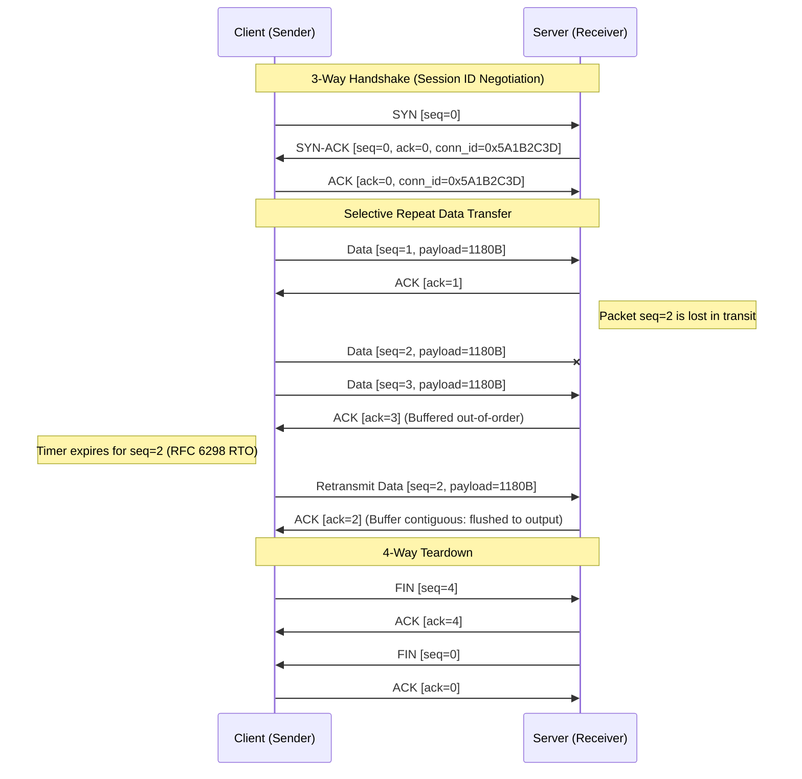
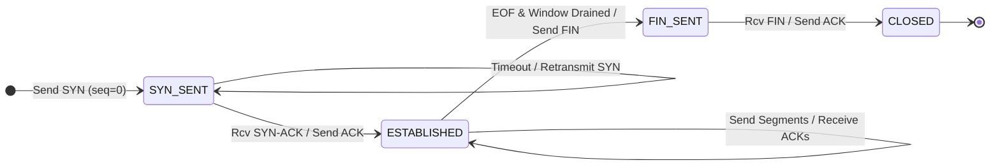

# udp-rdt: Reliable Data Transfer Protocol over UDP

[](https://github.com/josefambruz/udp-rdt/actions/workflows/ci.yml)
[](https://en.cppreference.com/w/cpp/20)
[](LICENSE)

> A high-performance, user-space transport protocol implementation in C++20 providing reliable, ordered, and integrity-verified byte-stream delivery over unreliable UDP datagrams.

---

## Visuals & Demo

```
+---------------------------------------------------------------------------------+
| SERVER TERMINAL ($ ./udp-rdt -s -p 9000 -o received.bin)                        |
| [RECEIVER] SYN received. Sending SYN-ACK id: 2841920145                         |
| [RECEIVER] Connection established.                                              |
| [RECEIVER] Transfer completed. Connection closed.                               |
+---------------------------------------------------------------------------------+
| CLIENT TERMINAL ($ ./udp-rdt -c -a 127.0.0.1 -p 9000 -i dataset.bin)            |
| [SENDER] Connection established, id: 2841920145                                 |
| [SENDER] Transfer complete, connection closed.                                  |
+---------------------------------------------------------------------------------+
| INTEGRITY VERIFICATION                                                          |
| $ sha256sum dataset.bin received.bin                                            |
| e3b0c44298fc1c149afbf4c8996fb92427ae41e4649b934ca495991b7852b855 dataset.bin   |
| e3b0c44298fc1c149afbf4c8996fb92427ae41e4649b934ca495991b7852b855 received.bin  |
| -> SHA-256 MATCH VERIFIED (100% Bit-Exact Transfer)                            |
+---------------------------------------------------------------------------------+
```
*(CLI recording placeholder: asciinema / demo GIF demo_transfer.gif)*

---

## Architecture & Key Highlights

`udp-rdt` implements transport-layer reliability mechanisms directly in user space on top of raw UDP sockets. It emulates TCP's reliability guarantees while operating within constrained datagram boundaries (1200-byte max segment size).

```
   +------------------------------------------------------------+
   |                     Application Layer                      |
   |              (File I/O, Unix Pipelines, Stdio)             |
   +------------------------------------------------------------+
                                  |
                   Zero-Copy Event Dispatch (poll)
                                  v
   +------------------------------------------------------------+
   |                         udp-rdt                            |
   |  +--------------------+  +-------------------------------+ |
   |  |     RdtSender      |  |          RdtReceiver          | |
   |  | Selective Repeat   |  | Out-of-Order Reassembly Buffer| |
   |  | Sliding Window(64) |  | Immediate Per-Packet ACKs     | |
   |  +--------------------+  +-------------------------------+ |
   |             |                            |                 |
   |  +-------------------------------------------------------+ |
   |  |             TimerManager (RFC 6298 RTO)               | |
   |  |        Smoothed RTT + RTTVAR + Exponential Backoff    | |
   |  +-------------------------------------------------------+ |
   |  |          Packet Frame Engine & IEEE 802.3 CRC-32      | |
   |  +-------------------------------------------------------+ |
   +------------------------------------------------------------+
                                  |
                                  v
   +------------------------------------------------------------+
   |             POSIX Sockets (Dual-Stack IPv4 / IPv6)         |
   |                         UDP / IP                           |
   +------------------------------------------------------------+
```

### Key Technical Highlights
- **Single-Threaded Event Loop with `poll()`**: Both network socket activity and local file descriptors are multiplexed in an asynchronous `poll()` loop (`Application::run`). This eliminates lock contention and thread synchronization overhead.
- **Selective Repeat (SR) ARQ**: Segments are uniquely indexed by 32-bit sequence numbers. The sender manages a sliding window deque (default capacity: 64 segments), while the receiver buffers out-of-order packets in an ordered red-black tree (`std::map`), flushing to disk as soon as missing gaps are filled.
- **Adaptive Retransmission Timeout (RFC 6298)**: Dynamic RTO calculation incorporates Smoothed Round-Trip Time ($SRTT$) and Round-Trip Time Variation ($RTTVAR$). Exponential backoff ($RTO \times 2$, bounded between 10ms and 5s) handles network congestion.
- **Zero-Copy I/O Backpressure**: When the sliding window is full (64 outstanding unacknowledged segments), the sender removes its input file descriptor from the `poll()` checklist, halting reads until acknowledged packets advance the send window.
- **Connection Isolation**: A cryptographically random 32-bit Connection ID is generated by the receiver during the 3-way handshake to prevent crosstalk from delayed or interleaved sessions.
- **Data Integrity**: Every datagram includes an IEEE 802.3 32-bit CRC checksum protecting both the 20-byte protocol header and payload.

---

### Protocol Header Specification

Multi-byte fields are transmitted in Network Byte Order (Big Endian).

```
 0                   1                   2                   3
 0 1 2 3 4 5 6 7 8 9 0 1 2 3 4 5 6 7 8 9 0 1 2 3 4 5 6 7 8 9 0 1
+-+-+-+-+-+-+-+-+-+-+-+-+-+-+-+-+-+-+-+-+-+-+-+-+-+-+-+-+-+-+-+-+
|                        Connection ID                          |
+-+-+-+-+-+-+-+-+-+-+-+-+-+-+-+-+-+-+-+-+-+-+-+-+-+-+-+-+-+-+-+-+
|                       Sequence Number                         |
+-+-+-+-+-+-+-+-+-+-+-+-+-+-+-+-+-+-+-+-+-+-+-+-+-+-+-+-+-+-+-+-+
|                    Acknowledgment Number                      |
+-+-+-+-+-+-+-+-+-+-+-+-+-+-+-+-+-+-+-+-+-+-+-+-+-+-+-+-+-+-+-+-+
|             Flags             |         Payload Length        |
+-+-+-+-+-+-+-+-+-+-+-+-+-+-+-+-+-+-+-+-+-+-+-+-+-+-+-+-+-+-+-+-+
|                           Checksum                            |
+-+-+-+-+-+-+-+-+-+-+-+-+-+-+-+-+-+-+-+-+-+-+-+-+-+-+-+-+-+-+-+-+
|                       Payload (0 - 1180 B)                    |
|                              ...                              |
+-+-+-+-+-+-+-+-+-+-+-+-+-+-+-+-+-+-+-+-+-+-+-+-+-+-+-+-+-+-+-+-+
```

| Offset (Bytes) | Field Name | Size | Description |
|:---------------|:-----------|:-----|:------------|
| `0` | Connection ID | 4 B | Unique 32-bit session identifier generated during handshake |
| `4` | Sequence Number | 4 B | Monotonically increasing segment identifier |
| `8` | Acknowledgment Number | 4 B | Sequence number being confirmed by peer |
| `12` | Flags | 2 B | Control bits: `SYN (0x1)`, `ACK (0x2)`, `FIN (0x4)`, `RST (0x8)` |
| `14` | Payload Length | 2 B | Payload byte length (0 to 1180 bytes) |
| `16` | Checksum | 4 B | IEEE 802.3 CRC-32 over header (with zeroed checksum) and payload |

---

### Protocol Lifecycle

#### 3-Way Handshake & Selective Repeat Data Transfer



#### State Machine Models



---

## Tech Stack

- **Core Language**: C++20 (standard library only; clean object-oriented architecture)
- **Networking & Systems**: POSIX Sockets (`sys/socket.h`), `poll.h`, Dual-Stack IPv4 / IPv6
- **Build System**: GNU Make with automatic header dependency tracking (`-MMD -MP`)
- **Unit Testing**: [doctest](https://github.com/doctest/doctest) (C++20 test suite)
- **Integration Testing & Simulation**: Python 3 `unittest` with multi-threaded fault proxy (`rdt_proxy.py`)
- **Kernel Impairment**: Linux `iproute2` (`tc netem`)
- **Memory Safety**: Valgrind Memcheck
- **Continuous Integration**: GitHub Actions

---

## Quickstart & Build Instructions

### Prerequisites
- Linux (x86_64) with `g++` supporting C++20
- `make`, `python3` (3.10+)
- Optional: `valgrind`, `iproute2` (for kernel-level netem emulation)

### 1. Build
```bash
git clone https://github.com/josefambruz/udp-rdt.git
cd udp-rdt
make
```
This compiles the release binary `udp-rdt` with `-O3` optimizations.

For all available make targets:
```bash
make help
```

### 2. Run Test Suites
```bash
# Run unit tests and Python integration test suite (16 scenarios)
make test

# Memory leak verification (requires valgrind)
make test-valgrind

# Kernel-level traffic shaping test (requires sudo / tc)
sudo make test-netem
```

---

## Usage Examples

### Server Mode (`-s`)
```bash
./udp-rdt -s -p <PORT> [-a <BIND_ADDRESS>] [-o <OUTPUT_FILE>] [-w <TIMEOUT>]
```
- `-p`: Port to listen on.
- `-a`: Optional bind address (defaults to dual-stack IPv4/IPv6 `INADDR_ANY`).
- `-o`: Output destination file (defaults to `stdout` if omitted or `-`).
- `-w`: Maximum idle progress timeout in seconds (default: 1s).

### Client Mode (`-c`)
```bash
./udp-rdt -c -a <DEST_ADDRESS> -p <PORT> [-i <INPUT_FILE>] [-w <TIMEOUT>]
```
- `-a`: Destination IP address or hostname (**required**).
- `-p`: Destination port (**required**).
- `-i`: Source file path (defaults to `stdin` if omitted or `-`).
- `-w`: Maximum idle progress timeout in seconds (default: 1s).

### Execution Scenarios

#### 1. File Transfer
```bash
# Terminal 1: Receiver
./udp-rdt -s -p 9000 -o received_file.bin

# Terminal 2: Sender
./udp-rdt -c -a 127.0.0.1 -p 9000 -i source_file.bin
```

#### 2. Unix Pipeline Streaming (`stdin` to `stdout`)
```bash
# Terminal 1: Receiver writes stream directly to decompression tool
./udp-rdt -s -p 9000 | tar -xzvf -

# Terminal 2: Sender streams compressed archive over UDP
tar -czvf - ./data | ./udp-rdt -c -a 127.0.0.1 -p 9000
```

#### 3. Dual-Stack IPv6 Transfer
```bash
# Receiver listening on IPv6 localhost
./udp-rdt -s -p 9000 -a ::1 -o output.bin -w 10

# Sender transmitting over IPv6
./udp-rdt -c -a ::1 -p 9000 -i dataset.bin -w 10
```

---

## Empirical Resilience & Performance Benchmarks

Tested on Linux 6.19 x86_64 using the automated integration and traffic proxy suite:

| Scenario | Payload Size | Impairment Profile | Elapsed Time | SHA-256 Verification |
|:---|:---|:---|:---|:---|
| **Baseline File Transfer** | 50 KB | Ideal Loopback (0% loss, 0ms delay) | ~0.21s | **Exact Match** |
| **High Throughput** | 50 MB | Ideal Loopback (0% loss, 0ms delay) | ~2.28s | **Exact Match** |
| **Heavy Packet Loss** | 50 KB | 15% Random Drop Rate | ~1.08s | **Exact Match** |
| **High Jitter & Delay** | 50 KB | 20ms Base Delay, $\pm$10ms Jitter | ~0.85s | **Exact Match** |
| **Adverse Network Conditions**| 50 KB | 5% Loss, 5% Duplication, 10% Reordering | ~0.74s | **Exact Match** |
| **Empty File Boundary** | 0 Bytes | Clean EOF Handshake | ~0.21s | **Exact Match** |
| **Kernel `tc netem`** | 5 MB | 10% Loss, 5% Dup, 20ms Delay, 10ms Jitter | ~12.49s | **Exact Match** |

*Valgrind Memcheck: 0 errors from 0 contexts, 0 bytes definitely lost.*

---

## Roadmap & Current State

- **Current State**: Feature-complete, robust user-space transport protocol implementation with extensive automated test coverage and zero memory leaks.
- **Planned Enhancements**:
  - [ ] **Congestion Control Algorithms**: Dynamic congestion window sizing (AIMD, TCP Reno, CUBIC).
  - [ ] **Multi-Session Multiplexing**: Concurrent client handling via `epoll` or `io_uring`.
  - [ ] **Path MTU Discovery (PMTUD)**: Dynamic datagram sizing adapting to network paths larger or smaller than 1200 bytes.

---

## References

- [RFC 6298: Computing TCP's Retransmission Timer](https://datatracker.ietf.org/doc/html/rfc6298)
- [RFC 768: User Datagram Protocol](https://datatracker.ietf.org/doc/html/rfc768)
- [IEEE 802.3 Ethernet Standards: Cyclic Redundancy Check (CRC-32)](https://standards.ieee.org/)

---

## License

This project is licensed under the [MIT License](LICENSE) - see the [LICENSE](LICENSE) file for details.
